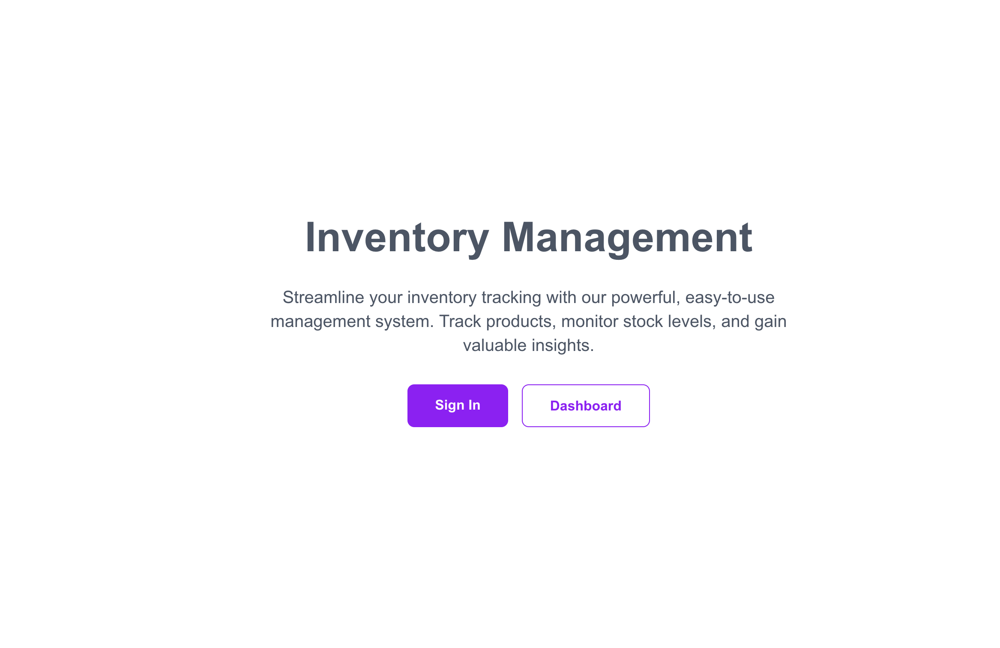
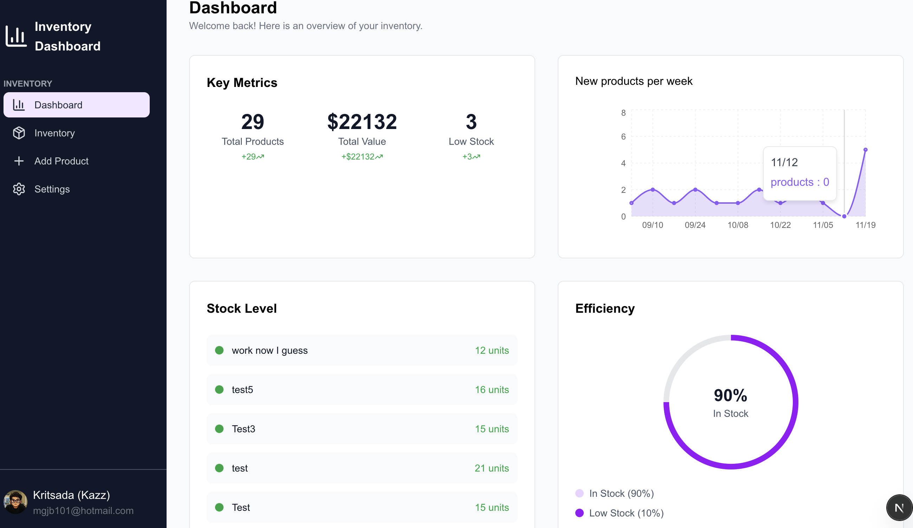
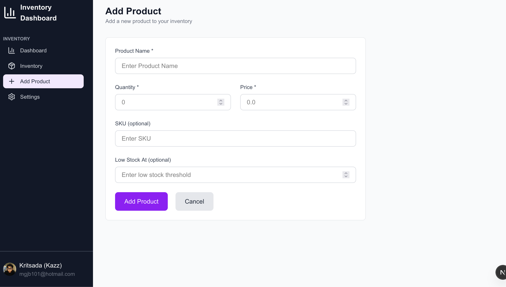
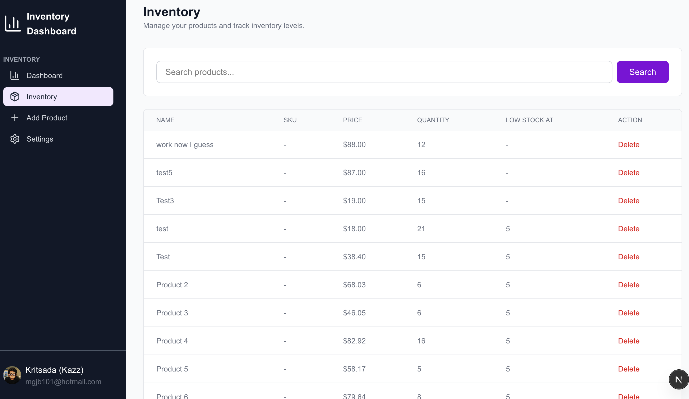
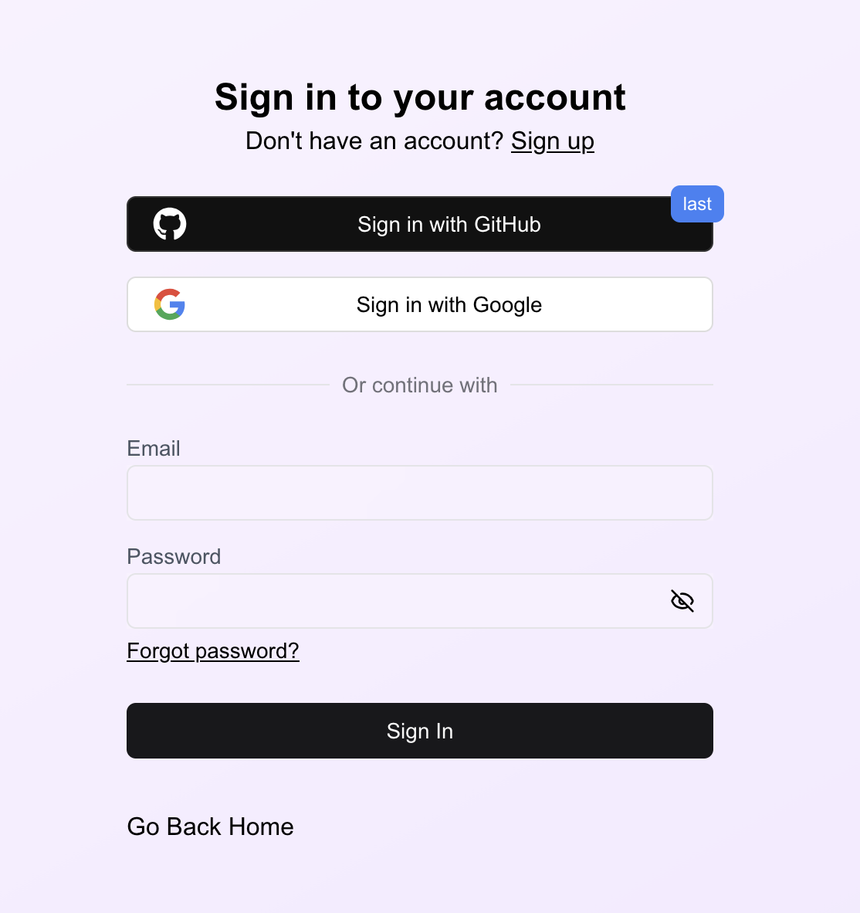

# Inventory Dashboard

A responsive inventory management dashboard for tracking products, stock levels, and low-stock alerts. Built with **Next.js**, **TypeScript**, **Prisma**, and Neon as database.

> 🔍 This project is focused on learning modern full-stack with a little bit of backed : Next.js, server components, Prisma ORM, and a simple but realistic inventory domain.

---
## 📸 Screenshots

### Landing Page


### Dashboard


### Add New Product


### Inventory Page


### Signup Page


## ✨ Features

- **Inventory Overview**
  - High-level summary of total products and stock
  - Visual indicator for in-stock percentage

- **Product List**
  - Paginated table of products
  - Basic information such as name, price, quantity, and low-stock threshold

- **Low-Stock Alerts**
  - Highlights products that are at or below the configured `lowStockAt` value

- **Modern UI**
  - Responsive layout that works on desktop and smaller screens

> Note: This is an in-progress learning project. Features may have some flaw.

---

## 🧱 Tech Stack

- **Framework:** Next.js (App Router)
- **Language:** TypeScript
- **Styling:** Tailwind CSS
- **ORM:** Prisma
- **Database:** Neon

---

## 🚀 Getting Started

```
git clone https://github.com/Kazz4343/inventorydashboard.git

cd inventorydashboard

npm install

recreate .env

npm prisma generate


